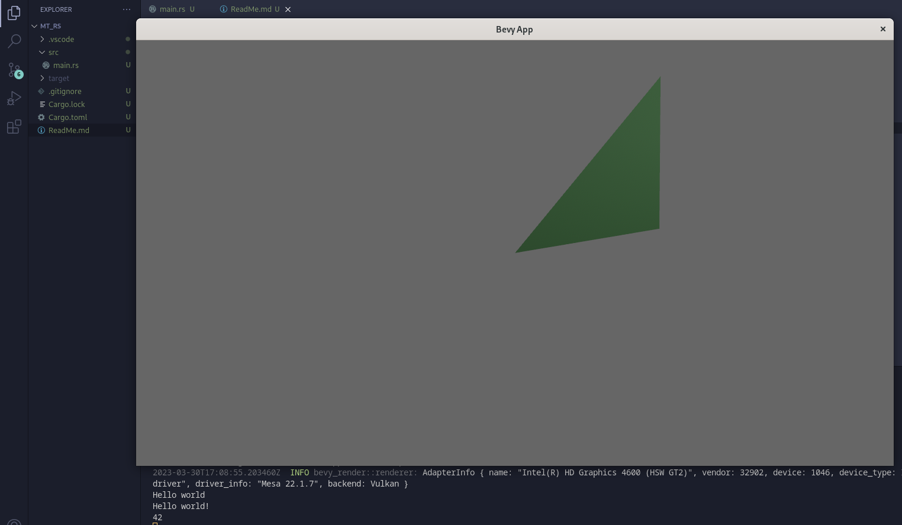

# mt_rs
Minetest clone project, written in rust

This project tries to behave like minetest does, at least as far as the modding LUA API is concerned.

Just a note: I have no experience in rust, so this should be fun.

## State
Basic triangle test code working, as well as LUA code execution

## Dependencies

- bevy
- luajit_rs

- [bevy system dependencies](https://github.com/bevyengine/bevy/blob/main/docs/linux_dependencies.md)

- [luajit system installation](https://luajit.org/install.html)
  - brief rundown:
    `git clone https://github.com/LuaJIT/LuaJIT`
    `make`
    `sudo make install`